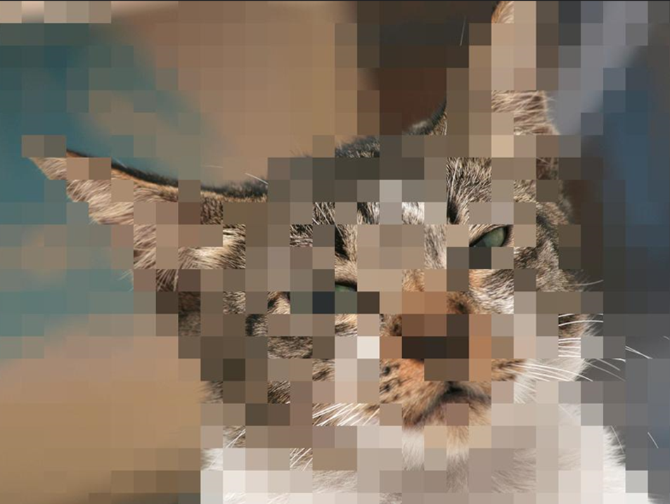
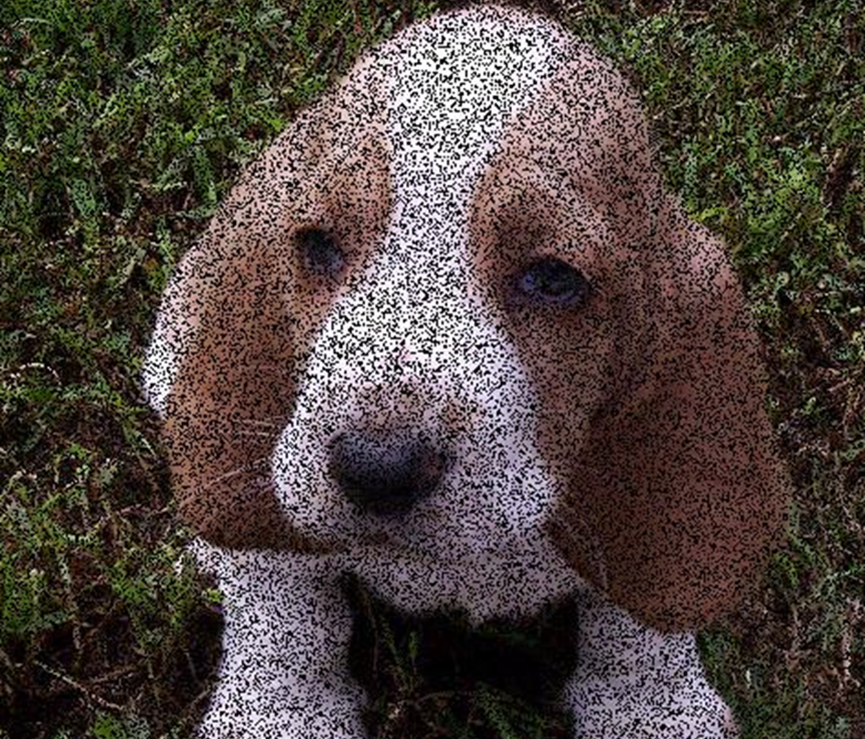
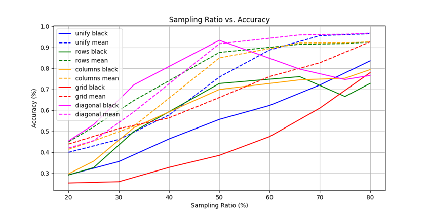

# Final_Project_EE
Final project in EE in TAU - Sublinear Classification of Images

This project aims to explore the practical implementation of sublinear sampling techniques in image processing. 
The primary objective is to determine the optimal balance between sampling ratios and classification accuracy using a consistent classification network (ResNet50). 
By evaluating the differences among various sampling methods, the project seeks to identify the most effective approach for achieving high classification performance with reduced computational resources.

In this project, I tested five different sampling methods, with each method having two variations for filling the unsampled pixels: black and local mean. This resulted in a total of ten sampling techniques. 
Each method was applied with sampling ratios ranging from 20% to 80%, and the results were evaluated using the classification network.

Grid Sampling method, filled with local mean (30%):
 

Diagonal Sampling method, filled with black (50%):

Uniform Sampling method, filled with black (70%):

Impact of various sampling methods on classification accuracy:

